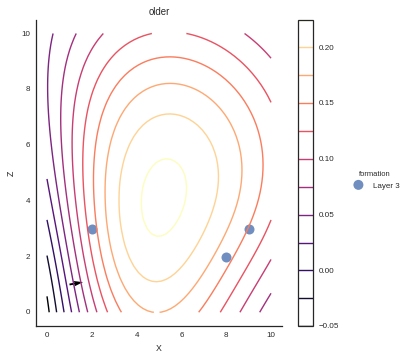

Example 2: Simple model
=======================

This notebook is a series of independent cells showing how to create a
simple model from the beginning to the end using GeMpy

Importing dependencies
~~~~~~~~~~~~~~~~~~~~~~

.. code:: python

    # Importing
    import theano.tensor as T
    import sys, os
    sys.path.append("../GeMpy")
    
    # Importing GeMpy modules
    import GeMpy
    
    # Reloading (only for development purposes)
    import importlib
    importlib.reload(GeMpy)
    
    # Usuful packages
    import numpy as np
    import pandas as pn
    
    import matplotlib.pyplot as plt
    
    # This was to choose the gpu
    os.environ['CUDA_LAUNCH_BLOCKING'] = '1'
    
    # Default options of printin
    np.set_printoptions(precision = 6, linewidth= 130, suppress =  True)
    
    %matplotlib inline
    #%matplotlib notebook

Visualize data
--------------

.. code:: python

    # Setting the extent
    geo_data = GeMpy.import_data([0,10,0,10,0,10])
    GeMpy.get_raw_data(geo_data)

.. raw:: html

    

    <table border="1" class="dataframe">
      <thead>
        <tr style="text-align: right;">
          <th></th>
          <th></th>
          <th>G_x</th>
          <th>G_y</th>
          <th>G_z</th>
          <th>X</th>
          <th>Y</th>
          <th>Z</th>
          <th>azimuth</th>
          <th>dip</th>
          <th>formation</th>
          <th>polarity</th>
          <th>series</th>
        </tr>
      </thead>
      <tbody>
      </tbody>
    </table>
    

.. code:: python

    # =========================
    # DATA GENERATION IN PYTHON
    # =========================
    # Layers coordinates
    layer_1 = np.array([[0.5,4,7], [2,4,6.5], [4,4,7], [5,4,6]])#-np.array([5,5,4]))/8+0.5
    layer_2 = np.array([[3,4,5], [6,4,4],[8,4,4], [7,4,3], [1,4,6]])
    layers = np.asarray([layer_1,layer_2])
    
    # Foliations coordinates
    dip_pos_1 = np.array([7,4,7])#- np.array([5,5,4]))/8+0.5
    dip_pos_2 = np.array([2.,4,4])
    
    # Dips
    dip_angle_1 = float(15)
    dip_angle_2 = float(340)
    dips_angles = np.asarray([dip_angle_1, dip_angle_2], dtype="float64")
    
    # Azimuths
    azimuths = np.asarray([90,90], dtype="float64")
    
    # Polarity
    polarity = np.asarray([1,1], dtype="float64")

.. code:: python

    # Setting foliations and interfaces values
    GeMpy.set_interfaces(geo_data, pn.DataFrame(
        data = {"X" :np.append(layer_1[:, 0],layer_2[:,0]),
                "Y" :np.append(layer_1[:, 1],layer_2[:,1]),
                "Z" :np.append(layer_1[:, 2],layer_2[:,2]),
                "formation" : np.append(
                   np.tile("Layer 1", len(layer_1)), 
                   np.tile("Layer 2", len(layer_2))),
                "labels" : [r'${\bf{x}}_{\alpha \, 0}^1$',
                   r'${\bf{x}}_{\alpha \, 1}^1$',
                   r'${\bf{x}}_{\alpha \, 2}^1$',
                   r'${\bf{x}}_{\alpha \, 3}^1$',
                   r'${\bf{x}}_{\alpha \, 0}^2$',
                   r'${\bf{x}}_{\alpha \, 1}^2$',
                   r'${\bf{x}}_{\alpha \, 2}^2$',
                   r'${\bf{x}}_{\alpha \, 3}^2$',
                   r'${\bf{x}}_{\alpha \, 4}^2$'] }))
    
    GeMpy.set_foliations(geo_data,  pn.DataFrame(
        data = {"X" :np.append(dip_pos_1[0],dip_pos_2[0]),
                "Y" :np.append(dip_pos_1[ 1],dip_pos_2[1]),
                "Z" :np.append(dip_pos_1[ 2],dip_pos_2[2]),
                "azimuth" : azimuths,
                "dip" : dips_angles,
                "polarity" : polarity,
                "formation" : ["Layer 1", "Layer 2"],
                "labels" : [r'${\bf{x}}_{\beta \,{0}}$',
                  r'${\bf{x}}_{\beta \,{1}}$'] })) 
    
    GeMpy.get_raw_data(geo_data)

.. raw:: html

    

    <table border="1" class="dataframe">
      <thead>
        <tr style="text-align: right;">
          <th></th>
          <th></th>
          <th>G_x</th>
          <th>G_y</th>
          <th>G_z</th>
          <th>X</th>
          <th>Y</th>
          <th>Z</th>
          <th>azimuth</th>
          <th>dip</th>
          <th>formation</th>
          <th>labels</th>
          <th>polarity</th>
          <th>series</th>
        </tr>
      </thead>
      <tbody>
        <tr>
          <th rowspan="9" valign="top">interfaces</th>
          <th>0</th>
          <td>NaN</td>
          <td>NaN</td>
          <td>NaN</td>
          <td>0.5</td>
          <td>4.0</td>
          <td>7.0</td>
          <td>NaN</td>
          <td>NaN</td>
          <td>Layer 1</td>
          <td>${\bf{x}}_{\alpha \, 0}^1$</td>
          <td>NaN</td>
          <td>Default serie</td>
        </tr>
        <tr>
          <th>1</th>
          <td>NaN</td>
          <td>NaN</td>
          <td>NaN</td>
          <td>2.0</td>
          <td>4.0</td>
          <td>6.5</td>
          <td>NaN</td>
          <td>NaN</td>
          <td>Layer 1</td>
          <td>${\bf{x}}_{\alpha \, 1}^1$</td>
          <td>NaN</td>
          <td>Default serie</td>
        </tr>
        <tr>
          <th>2</th>
          <td>NaN</td>
          <td>NaN</td>
          <td>NaN</td>
          <td>4.0</td>
          <td>4.0</td>
          <td>7.0</td>
          <td>NaN</td>
          <td>NaN</td>
          <td>Layer 1</td>
          <td>${\bf{x}}_{\alpha \, 2}^1$</td>
          <td>NaN</td>
          <td>Default serie</td>
        </tr>
        <tr>
          <th>3</th>
          <td>NaN</td>
          <td>NaN</td>
          <td>NaN</td>
          <td>5.0</td>
          <td>4.0</td>
          <td>6.0</td>
          <td>NaN</td>
          <td>NaN</td>
          <td>Layer 1</td>
          <td>${\bf{x}}_{\alpha \, 3}^1$</td>
          <td>NaN</td>
          <td>Default serie</td>
        </tr>
        <tr>
          <th>4</th>
          <td>NaN</td>
          <td>NaN</td>
          <td>NaN</td>
          <td>3.0</td>
          <td>4.0</td>
          <td>5.0</td>
          <td>NaN</td>
          <td>NaN</td>
          <td>Layer 2</td>
          <td>${\bf{x}}_{\alpha \, 0}^2$</td>
          <td>NaN</td>
          <td>Default serie</td>
        </tr>
        <tr>
          <th>5</th>
          <td>NaN</td>
          <td>NaN</td>
          <td>NaN</td>
          <td>6.0</td>
          <td>4.0</td>
          <td>4.0</td>
          <td>NaN</td>
          <td>NaN</td>
          <td>Layer 2</td>
          <td>${\bf{x}}_{\alpha \, 1}^2$</td>
          <td>NaN</td>
          <td>Default serie</td>
        </tr>
        <tr>
          <th>6</th>
          <td>NaN</td>
          <td>NaN</td>
          <td>NaN</td>
          <td>8.0</td>
          <td>4.0</td>
          <td>4.0</td>
          <td>NaN</td>
          <td>NaN</td>
          <td>Layer 2</td>
          <td>${\bf{x}}_{\alpha \, 2}^2$</td>
          <td>NaN</td>
          <td>Default serie</td>
        </tr>
        <tr>
          <th>7</th>
          <td>NaN</td>
          <td>NaN</td>
          <td>NaN</td>
          <td>7.0</td>
          <td>4.0</td>
          <td>3.0</td>
          <td>NaN</td>
          <td>NaN</td>
          <td>Layer 2</td>
          <td>${\bf{x}}_{\alpha \, 3}^2$</td>
          <td>NaN</td>
          <td>Default serie</td>
        </tr>
        <tr>
          <th>8</th>
          <td>NaN</td>
          <td>NaN</td>
          <td>NaN</td>
          <td>1.0</td>
          <td>4.0</td>
          <td>6.0</td>
          <td>NaN</td>
          <td>NaN</td>
          <td>Layer 2</td>
          <td>${\bf{x}}_{\alpha \, 4}^2$</td>
          <td>NaN</td>
          <td>Default serie</td>
        </tr>
        <tr>
          <th rowspan="2" valign="top">foliations</th>
          <th>0</th>
          <td>0.258819</td>
          <td>1.584810e-17</td>
          <td>0.965926</td>
          <td>7.0</td>
          <td>4.0</td>
          <td>7.0</td>
          <td>90.0</td>
          <td>15.0</td>
          <td>Layer 1</td>
          <td>${\bf{x}}_{\beta \,{0}}$</td>
          <td>1.0</td>
          <td>Default serie</td>
        </tr>
        <tr>
          <th>1</th>
          <td>-0.342020</td>
          <td>-2.094269e-17</td>
          <td>0.939693</td>
          <td>2.0</td>
          <td>4.0</td>
          <td>4.0</td>
          <td>90.0</td>
          <td>340.0</td>
          <td>Layer 2</td>
          <td>${\bf{x}}_{\beta \,{1}}$</td>
          <td>1.0</td>
          <td>Default serie</td>
        </tr>
      </tbody>
    </table>
    

.. code:: python

    # Plotting data
    GeMpy.plot_data(geo_data)
    GeMpy.PlotData.annotate_plot(GeMpy.get_raw_data(geo_data),
                                 'labels','X', 'Z', size = 'x-large')

.. image:: Example_2_Simple_files/Example_2_Simple_8_0.png

Interactive pandas Dataframe
~~~~~~~~~~~~~~~~~~~~~~~~~~~~

Using qgrid it is possible to modify the tables in place as following:

.. code:: python

    GeMpy.i_set_data(geo_data)

Grid and potential field
------------------------

We can see the potential field generated out of the data above

.. code:: python

    GeMpy.set_interpolator(geo_data, u_grade=0)
    GeMpy.plot_potential_field(geo_data, 4, direction='y', colorbar = True, cmap = 'magma')

.. image:: Example_2_Simple_files/Example_2_Simple_12_0.png

.. code:: python

    from ipywidgets import widgets
    from ipywidgets import interact
    def cov_cubic_f(r,a = 6, c_o = 1):↔
    def cov_cubic_d1_f(r,a = 6., c_o = 1):↔
    
    def cov_cubic_d2_f(r, a = 6, c_o = 1):↔
    
    def plot_potential_var(a = 10, c_o = 1, nugget_effect = 0):↔
    
    def plot_potential_direction_var( a = 10, c_o = 1, nugget_effect = 0):↔
    
    def plot_directionU_directionU_var(a = 10, c_o = 1, nugget_effect = 0):↔
    
        plt.title("Variogram")
        plt.margins(0,0.1)
        
        ax2 = fig.add_subplot(122)
        ax2.plot(x,np.asarray(y))
        ax2.scatter(0,nugget_effect+y[0], s = 20)
    
        plt.title("Covariance Function")
        plt.tight_layout()
        plt.margins(0,0.1)
        plt.suptitle('$C_{\partial {Z}/ \partial x, \, \partial {Z}/ \partial x}(h_x)$'
                     , y = 1.08, fontsize=15)
        
    def plot_directionU_directionV_var(a = 10, c_o = 1, nugget_effect = 0):↔
    
        plt.title("Variogram")
        plt.margins(0,0.1)
        
        ax2 = fig.add_subplot(122)
        ax2.plot(x,np.asarray(y))
        ax2.scatter(0,nugget_effect+y[0], s = 20)
        plt.title("Covariance Function")
        plt.tight_layout()
        plt.margins(0,0.1)
        plt.suptitle('$C_{\partial {Z}/ \partial x, \, \partial {Z}/ \partial y}(h_x,h_y)$'
                     , y = 1.08, fontsize=15)
        
    
    def plot_all(a = 10, c_o = 1, nugget_effect = 0):↔

From potential field to block
-----------------------------

The potential field describe the deposition form and direction of a
basin. However, in most scenarios the real goal of structural modeling
is the segmentation in layers of areas with significant change of
properties (e.g. shales and carbonates). Since we need to provide at
least one point per interface, we can easily compute the value of the
potential field at the intersections between two layers. Therefore, by
simple comparison between a concrete value of the potential field and
the values of the interfaces it is possible to segment the domain into
layers Fig X.

.. code:: python

    GeMpy.compute_block_model(geo_data)
    GeMpy.plot_section(geo_data, 13)

.. parsed-literal::

    <Visualization.PlotData at 0x7fb7d1e4c208>

.. image:: Example_2_Simple_files/Example_2_Simple_16_1.png

Combining potential fields: Depositional series
~~~~~~~~~~~~~~~~~~~~~~~~~~~~~~~~~~~~~~~~~~~~~~~

In reality, most geological settings are formed by a concatenation of
depositional phases separated clearly by unconformity bounderies. Each
of these phases can be model by a potential field. In order to capture
this behavior, we can classify the formations that belong to individual
depositional phase into categories or series. The potential field
computed for each of these series could be seen as a sort of evolution
of the basin if an unconformity did not occur. Finally, sorting the
temporal relation between series allow to superpose the corresponding
potential field at an specific location.

In the next example, we add a new serie consisting in a layer---'Layer
3'--- Fig X, which generate the potential field of Fig X and
subsequently the block Figure X.

.. code:: python

    layer_3 = np.array([[2,4,3], [8,4,2], [9,4,3]])
    dip_pos_3 = np.array([1,4,1])
    dip_angle_3 = float(80)
    azimuth_3 = 90
    polarity_3 = 1
    
    
    
    GeMpy.set_interfaces(geo_data, pn.DataFrame(
        data = {"X" :layer_3[:, 0],
                "Y" :layer_3[:, 1],
                "Z" :layer_3[:, 2],
                "formation" : np.tile("Layer 3", len(layer_3)), 
                "labels" : [  r'${\bf{x}}_{\alpha \, 0}^3$',
                               r'${\bf{x}}_{\alpha \, 1}^3$',
                               r'${\bf{x}}_{\alpha \, 2}^3$'] }), append = True)
    GeMpy.get_raw_data(geo_data,"interfaces")

.. parsed-literal::

    I am here

.. raw:: html

    

    <table border="1" class="dataframe">
      <thead>
        <tr style="text-align: right;">
          <th></th>
          <th>X</th>
          <th>Y</th>
          <th>Z</th>
          <th>formation</th>
          <th>labels</th>
          <th>series</th>
        </tr>
      </thead>
      <tbody>
        <tr>
          <th>0</th>
          <td>0.5</td>
          <td>4.0</td>
          <td>7.0</td>
          <td>Layer 1</td>
          <td>${\bf{x}}_{\alpha \, 0}^1$</td>
          <td>Default serie</td>
        </tr>
        <tr>
          <th>1</th>
          <td>2.0</td>
          <td>4.0</td>
          <td>6.5</td>
          <td>Layer 1</td>
          <td>${\bf{x}}_{\alpha \, 1}^1$</td>
          <td>Default serie</td>
        </tr>
        <tr>
          <th>2</th>
          <td>4.0</td>
          <td>4.0</td>
          <td>7.0</td>
          <td>Layer 1</td>
          <td>${\bf{x}}_{\alpha \, 2}^1$</td>
          <td>Default serie</td>
        </tr>
        <tr>
          <th>3</th>
          <td>5.0</td>
          <td>4.0</td>
          <td>6.0</td>
          <td>Layer 1</td>
          <td>${\bf{x}}_{\alpha \, 3}^1$</td>
          <td>Default serie</td>
        </tr>
        <tr>
          <th>4</th>
          <td>3.0</td>
          <td>4.0</td>
          <td>5.0</td>
          <td>Layer 2</td>
          <td>${\bf{x}}_{\alpha \, 0}^2$</td>
          <td>Default serie</td>
        </tr>
        <tr>
          <th>5</th>
          <td>6.0</td>
          <td>4.0</td>
          <td>4.0</td>
          <td>Layer 2</td>
          <td>${\bf{x}}_{\alpha \, 1}^2$</td>
          <td>Default serie</td>
        </tr>
        <tr>
          <th>6</th>
          <td>8.0</td>
          <td>4.0</td>
          <td>4.0</td>
          <td>Layer 2</td>
          <td>${\bf{x}}_{\alpha \, 2}^2$</td>
          <td>Default serie</td>
        </tr>
        <tr>
          <th>7</th>
          <td>7.0</td>
          <td>4.0</td>
          <td>3.0</td>
          <td>Layer 2</td>
          <td>${\bf{x}}_{\alpha \, 3}^2$</td>
          <td>Default serie</td>
        </tr>
        <tr>
          <th>8</th>
          <td>1.0</td>
          <td>4.0</td>
          <td>6.0</td>
          <td>Layer 2</td>
          <td>${\bf{x}}_{\alpha \, 4}^2$</td>
          <td>Default serie</td>
        </tr>
        <tr>
          <th>0</th>
          <td>2.0</td>
          <td>4.0</td>
          <td>3.0</td>
          <td>Layer 3</td>
          <td>${\bf{x}}_{\alpha \, 0}^3$</td>
          <td>Default serie</td>
        </tr>
        <tr>
          <th>1</th>
          <td>8.0</td>
          <td>4.0</td>
          <td>2.0</td>
          <td>Layer 3</td>
          <td>${\bf{x}}_{\alpha \, 1}^3$</td>
          <td>Default serie</td>
        </tr>
        <tr>
          <th>2</th>
          <td>9.0</td>
          <td>4.0</td>
          <td>3.0</td>
          <td>Layer 3</td>
          <td>${\bf{x}}_{\alpha \, 2}^3$</td>
          <td>Default serie</td>
        </tr>
      </tbody>
    </table>
    

.. code:: python

     
    GeMpy.set_foliations(geo_data, pn.DataFrame(data = {
                         "X" : dip_pos_3[0],
                         "Y" : dip_pos_3[1],
                         "Z" : dip_pos_3[2],
                         "azimuth" : azimuth_3,
                         "dip" : dip_angle_3,
                         "polarity" : polarity_3,
                         "formation" : [ 'Layer 3'],
                         "labels" : r'${\bf{x}}_{\beta \,{2}}$'}), append = True)
    GeMpy.get_raw_data(geo_data, 'foliations')

.. raw:: html

    

    <table border="1" class="dataframe">
      <thead>
        <tr style="text-align: right;">
          <th></th>
          <th>G_x</th>
          <th>G_y</th>
          <th>G_z</th>
          <th>X</th>
          <th>Y</th>
          <th>Z</th>
          <th>azimuth</th>
          <th>dip</th>
          <th>formation</th>
          <th>labels</th>
          <th>polarity</th>
          <th>series</th>
        </tr>
      </thead>
      <tbody>
        <tr>
          <th>0</th>
          <td>0.258819</td>
          <td>1.584810e-17</td>
          <td>0.965926</td>
          <td>7.0</td>
          <td>4.0</td>
          <td>7.0</td>
          <td>90.0</td>
          <td>15.0</td>
          <td>Layer 1</td>
          <td>${\bf{x}}_{\beta \,{0}}$</td>
          <td>1.0</td>
          <td>Default serie</td>
        </tr>
        <tr>
          <th>1</th>
          <td>-0.342020</td>
          <td>-2.094269e-17</td>
          <td>0.939693</td>
          <td>2.0</td>
          <td>4.0</td>
          <td>4.0</td>
          <td>90.0</td>
          <td>340.0</td>
          <td>Layer 2</td>
          <td>${\bf{x}}_{\beta \,{1}}$</td>
          <td>1.0</td>
          <td>Default serie</td>
        </tr>
        <tr>
          <th>0</th>
          <td>0.984808</td>
          <td>6.030208e-17</td>
          <td>0.173648</td>
          <td>1.0</td>
          <td>4.0</td>
          <td>1.0</td>
          <td>90.0</td>
          <td>80.0</td>
          <td>Layer 3</td>
          <td>${\bf{x}}_{\beta \,{2}}$</td>
          <td>1.0</td>
          <td>Default serie</td>
        </tr>
      </tbody>
    </table>
    

.. code:: python

    GeMpy.set_data_series(geo_data, {'younger': ('Layer 1', 'Layer 2'),
                          'older': 'Layer 3'}, order_series = ['younger', 'older'])

.. code:: python

    GeMpy.plot_data(geo_data)

.. parsed-literal::

    <Visualization.PlotData at 0x7fb7d2c3a2b0>

.. image:: Example_2_Simple_files/Example_2_Simple_22_1.png

This potential field gives the following block

.. code:: python

    GeMpy.plot_potential_field(geo_data,4, n_pf=1, direction='y', 
                               colorbar = True, cmap = 'magma' )

.. code:: python

    GeMpy.get_raw_data(geo_data)

.. raw:: html

    

    <table border="1" class="dataframe">
      <thead>
        <tr style="text-align: right;">
          <th></th>
          <th></th>
          <th>G_x</th>
          <th>G_y</th>
          <th>G_z</th>
          <th>X</th>
          <th>Y</th>
          <th>Z</th>
          <th>azimuth</th>
          <th>dip</th>
          <th>formation</th>
          <th>labels</th>
          <th>polarity</th>
          <th>series</th>
        </tr>
      </thead>
      <tbody>
        <tr>
          <th rowspan="12" valign="top">interfaces</th>
          <th>0</th>
          <td>NaN</td>
          <td>NaN</td>
          <td>NaN</td>
          <td>0.5</td>
          <td>4.0</td>
          <td>7.0</td>
          <td>NaN</td>
          <td>NaN</td>
          <td>Layer 1</td>
          <td>${\bf{x}}_{\alpha \, 0}^1$</td>
          <td>NaN</td>
          <td>younger</td>
        </tr>
        <tr>
          <th>1</th>
          <td>NaN</td>
          <td>NaN</td>
          <td>NaN</td>
          <td>2.0</td>
          <td>4.0</td>
          <td>6.5</td>
          <td>NaN</td>
          <td>NaN</td>
          <td>Layer 1</td>
          <td>${\bf{x}}_{\alpha \, 1}^1$</td>
          <td>NaN</td>
          <td>younger</td>
        </tr>
        <tr>
          <th>2</th>
          <td>NaN</td>
          <td>NaN</td>
          <td>NaN</td>
          <td>4.0</td>
          <td>4.0</td>
          <td>7.0</td>
          <td>NaN</td>
          <td>NaN</td>
          <td>Layer 1</td>
          <td>${\bf{x}}_{\alpha \, 2}^1$</td>
          <td>NaN</td>
          <td>younger</td>
        </tr>
        <tr>
          <th>3</th>
          <td>NaN</td>
          <td>NaN</td>
          <td>NaN</td>
          <td>5.0</td>
          <td>4.0</td>
          <td>6.0</td>
          <td>NaN</td>
          <td>NaN</td>
          <td>Layer 1</td>
          <td>${\bf{x}}_{\alpha \, 3}^1$</td>
          <td>NaN</td>
          <td>younger</td>
        </tr>
        <tr>
          <th>4</th>
          <td>NaN</td>
          <td>NaN</td>
          <td>NaN</td>
          <td>3.0</td>
          <td>4.0</td>
          <td>5.0</td>
          <td>NaN</td>
          <td>NaN</td>
          <td>Layer 2</td>
          <td>${\bf{x}}_{\alpha \, 0}^2$</td>
          <td>NaN</td>
          <td>younger</td>
        </tr>
        <tr>
          <th>5</th>
          <td>NaN</td>
          <td>NaN</td>
          <td>NaN</td>
          <td>6.0</td>
          <td>4.0</td>
          <td>4.0</td>
          <td>NaN</td>
          <td>NaN</td>
          <td>Layer 2</td>
          <td>${\bf{x}}_{\alpha \, 1}^2$</td>
          <td>NaN</td>
          <td>younger</td>
        </tr>
        <tr>
          <th>6</th>
          <td>NaN</td>
          <td>NaN</td>
          <td>NaN</td>
          <td>8.0</td>
          <td>4.0</td>
          <td>4.0</td>
          <td>NaN</td>
          <td>NaN</td>
          <td>Layer 2</td>
          <td>${\bf{x}}_{\alpha \, 2}^2$</td>
          <td>NaN</td>
          <td>younger</td>
        </tr>
        <tr>
          <th>7</th>
          <td>NaN</td>
          <td>NaN</td>
          <td>NaN</td>
          <td>7.0</td>
          <td>4.0</td>
          <td>3.0</td>
          <td>NaN</td>
          <td>NaN</td>
          <td>Layer 2</td>
          <td>${\bf{x}}_{\alpha \, 3}^2$</td>
          <td>NaN</td>
          <td>younger</td>
        </tr>
        <tr>
          <th>8</th>
          <td>NaN</td>
          <td>NaN</td>
          <td>NaN</td>
          <td>1.0</td>
          <td>4.0</td>
          <td>6.0</td>
          <td>NaN</td>
          <td>NaN</td>
          <td>Layer 2</td>
          <td>${\bf{x}}_{\alpha \, 4}^2$</td>
          <td>NaN</td>
          <td>younger</td>
        </tr>
        <tr>
          <th>0</th>
          <td>NaN</td>
          <td>NaN</td>
          <td>NaN</td>
          <td>2.0</td>
          <td>4.0</td>
          <td>3.0</td>
          <td>NaN</td>
          <td>NaN</td>
          <td>Layer 3</td>
          <td>${\bf{x}}_{\alpha \, 0}^3$</td>
          <td>NaN</td>
          <td>older</td>
        </tr>
        <tr>
          <th>1</th>
          <td>NaN</td>
          <td>NaN</td>
          <td>NaN</td>
          <td>8.0</td>
          <td>4.0</td>
          <td>2.0</td>
          <td>NaN</td>
          <td>NaN</td>
          <td>Layer 3</td>
          <td>${\bf{x}}_{\alpha \, 1}^3$</td>
          <td>NaN</td>
          <td>older</td>
        </tr>
        <tr>
          <th>2</th>
          <td>NaN</td>
          <td>NaN</td>
          <td>NaN</td>
          <td>9.0</td>
          <td>4.0</td>
          <td>3.0</td>
          <td>NaN</td>
          <td>NaN</td>
          <td>Layer 3</td>
          <td>${\bf{x}}_{\alpha \, 2}^3$</td>
          <td>NaN</td>
          <td>older</td>
        </tr>
        <tr>
          <th rowspan="3" valign="top">foliations</th>
          <th>0</th>
          <td>0.258819</td>
          <td>1.584810e-17</td>
          <td>0.965926</td>
          <td>7.0</td>
          <td>4.0</td>
          <td>7.0</td>
          <td>90.0</td>
          <td>15.0</td>
          <td>Layer 1</td>
          <td>${\bf{x}}_{\beta \,{0}}$</td>
          <td>1.0</td>
          <td>younger</td>
        </tr>
        <tr>
          <th>1</th>
          <td>-0.342020</td>
          <td>-2.094269e-17</td>
          <td>0.939693</td>
          <td>2.0</td>
          <td>4.0</td>
          <td>4.0</td>
          <td>90.0</td>
          <td>340.0</td>
          <td>Layer 2</td>
          <td>${\bf{x}}_{\beta \,{1}}$</td>
          <td>1.0</td>
          <td>younger</td>
        </tr>
        <tr>
          <th>0</th>
          <td>0.984808</td>
          <td>6.030208e-17</td>
          <td>0.173648</td>
          <td>1.0</td>
          <td>4.0</td>
          <td>1.0</td>
          <td>90.0</td>
          <td>80.0</td>
          <td>Layer 3</td>
          <td>${\bf{x}}_{\beta \,{2}}$</td>
          <td>1.0</td>
          <td>older</td>
        </tr>
      </tbody>
    </table>
    

Combining both potential field where the first potential field is
younger than the second we can obtain the following structure.

.. code:: python

    GeMpy.compute_block_model(geo_data, series_number= 'all', verbose = 0)
    GeMpy.plot_section(geo_data, 13)

.. parsed-literal::

    <Visualization.PlotData at 0x7fb7c35cd828>

.. image:: Example_2_Simple_files/Example_2_Simple_27_1.png

Side note: Example of covariances involved in the cokriging system
------------------------------------------------------------------

.. code:: python

    plot_potential_var(10,10**2 / 14 / 3  , 0.01)
    
    plot_all(10,10**2 / 14 / 3  , 0.01) # 0**2 /14/3

.. image:: Example_2_Simple_files/Example_2_Simple_29_0.png

.. image:: Example_2_Simple_files/Example_2_Simple_29_1.png

.. image:: Example_2_Simple_files/Example_2_Simple_29_2.png

.. image:: Example_2_Simple_files/Example_2_Simple_29_3.png

