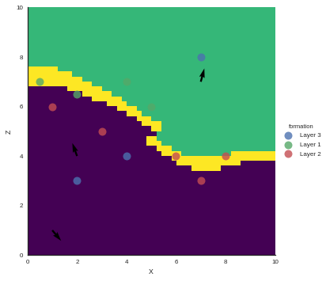

Example Faults
==============

Generating data
~~~~~~~~~~~~~~~

.. code:: ipython3

    # Importing and data
    import theano.tensor as T
    import theano
    import sys, os
    sys.path.append("../GeMpy")
    
    # Importing GeMpy modules
    import GeMpy
    
    # Reloading (only for development purposes)
    import importlib
    importlib.reload(GeMpy)
    
    # Usuful packages
    import numpy as np
    import pandas as pn
    
    import matplotlib.pyplot as plt
    
    # This was to choose the gpu
    os.environ['CUDA_LAUNCH_BLOCKING'] = '1'
    
    # Default options of printin
    np.set_printoptions(precision = 6, linewidth= 130, suppress =  True)
    
    #%matplotlib inline
    %matplotlib inline
    
    
    
    # Setting the extent
    geo_data = GeMpy.import_data([0,10,0,10,0,10], [50,50,50])
    
    
    # =========================
    # DATA GENERATION IN PYTHON
    # =========================
    # Layers coordinates
    layer_1 = np.array([[0.5,4,7], [2,4,6.5], [4,4,7], [5,4,6]])#-np.array([5,5,4]))/8+0.5
    layer_2 = np.array([[3,4,5], [6,4,4],[8,4,4], [7,4,3], [1,4,6]])
    layers = np.asarray([layer_1,layer_2])
    
    # Foliations coordinates
    dip_pos_1 = np.array([7,4,7])#- np.array([5,5,4]))/8+0.5
    dip_pos_2 = np.array([2.,4,4])
    
    # Dips
    dip_angle_1 = float(15)
    dip_angle_2 = float(340)
    dips_angles = np.asarray([dip_angle_1, dip_angle_2], dtype="float64")
    
    # Azimuths
    azimuths = np.asarray([90,90], dtype="float64")
    
    # Polarity
    polarity = np.asarray([1,1], dtype="float64")
    
    # Setting foliations and interfaces values
    GeMpy.set_interfaces(geo_data, pn.DataFrame(
        data = {"X" :np.append(layer_1[:, 0],layer_2[:,0]),
                "Y" :np.append(layer_1[:, 1],layer_2[:,1]),
                "Z" :np.append(layer_1[:, 2],layer_2[:,2]),
                "formation" : np.append(
                   np.tile("Layer 1", len(layer_1)), 
                   np.tile("Layer 2", len(layer_2))),
                "labels" : [r'${\bf{x}}_{\alpha \, 0}^1$',
                   r'${\bf{x}}_{\alpha \, 1}^1$',
                   r'${\bf{x}}_{\alpha \, 2}^1$',
                   r'${\bf{x}}_{\alpha \, 3}^1$',
                   r'${\bf{x}}_{\alpha \, 0}^2$',
                   r'${\bf{x}}_{\alpha \, 1}^2$',
                   r'${\bf{x}}_{\alpha \, 2}^2$',
                   r'${\bf{x}}_{\alpha \, 3}^2$',
                   r'${\bf{x}}_{\alpha \, 4}^2$'] }))
    
    GeMpy.set_foliations(geo_data,  pn.DataFrame(
        data = {"X" :np.append(dip_pos_1[0],dip_pos_2[0]),
                "Y" :np.append(dip_pos_1[ 1],dip_pos_2[1]),
                "Z" :np.append(dip_pos_1[ 2],dip_pos_2[2]),
                "azimuth" : azimuths,
                "dip" : dips_angles,
                "polarity" : polarity,
                "formation" : ["Layer 1", "Layer 2"],
                "labels" : [r'${\bf{x}}_{\beta \,{0}}$',
                  r'${\bf{x}}_{\beta \,{1}}$'] })) 
    
    
    
    layer_3 = np.array([[2,4,3], [4,4,4], [7,4,8]])
    dip_pos_3 = np.array([1,4,1])
    dip_angle_3 = float(140)
    azimuth_3 = 90
    polarity_3 = 1
    
    
    
    GeMpy.set_interfaces(geo_data, pn.DataFrame(
        data = {"X" :layer_3[:, 0],
                "Y" :layer_3[:, 1],
                "Z" :layer_3[:, 2],
                "formation" : np.tile("Layer 3", len(layer_3)), 
                "labels" : [  r'${\bf{x}}_{\alpha \, 0}^3$',
                               r'${\bf{x}}_{\alpha \, 1}^3$',
                               r'${\bf{x}}_{\alpha \, 2}^3$'] }), append = True)
    GeMpy.get_raw_data(geo_data,"interfaces")
    
    
    GeMpy.set_foliations(geo_data, pn.DataFrame(data = {
                         "X" : dip_pos_3[0],
                         "Y" : dip_pos_3[1],
                         "Z" : dip_pos_3[2],
                
                         "azimuth" : azimuth_3,
                         "dip" : dip_angle_3,
                         "polarity" : polarity_3,
                         "formation" : [ 'Layer 3'],
                         "labels" : r'${\bf{x}}_{\beta \,{2}}$'}), append = True)

.. code:: ipython3

    # When we choose the series we have to set the faults in the first place
    GeMpy.set_data_series(geo_data, {'younger': ('Layer 1', 'Layer 2'),
                          'fault1': 'Layer 3'}, order_series = ['fault1', 'younger'])

.. code:: ipython3

    # Select series to interpolate (if you do not want to interpolate all)
    data_interp = GeMpy.set_interpolator(geo_data, u_grade = 0, verbose = [ 'faults_contribution',])

.. code:: ipython3

    # This are the shared parameters and the compilation of the function. This will be hidden as well at some point
    input_data_T = data_interp.interpolator.tg.input_parameters_list()

.. code:: ipython3

    # HERE when we compile we have to pass the number of formations that are faults!!
    debugging = theano.function(input_data_T, data_interp.interpolator.tg.whole_block_model(1), on_unused_input='ignore', 
                                allow_input_downcast=True, profile=True);

.. code:: ipython3

    # This prepares the user data to the theano function
    input_data_P = data_interp.interpolator.data_prep() 

.. code:: ipython3

    # Solution of theano
    sol = debugging(input_data_P[0], input_data_P[1], input_data_P[2], input_data_P[3],input_data_P[4], input_data_P[5])

.. parsed-literal::

    Faults contribution __str__ = [ 0.  0.  0. ...,  0.  0.  0.]
    Faults contribution __str__ = [ 0.023055  0.023055  0.023055 ...,  0.        0.        0.      ]

.. code:: ipython3

    #GeMpy.plot_potential_field(fault1, sol.reshape(50,50,50),13, plot_data = True)
    GeMpy.plot_section(geo_data, 30, block = sol, plot_data = True)

.. parsed-literal::

    <Visualization.PlotData at 0x7fb37664c160>

.. code:: ipython3

    lith0 = sol == 0
    lith1 = sol == 2
    lith2 = sol == 3
    

.. code:: ipython3

    import ipyvolume.pylab as p3
    import ipyvolume.serialize
    ipyvolume.serialize.performance = 1 # 1 for binary, 0 for JSON
    #p3 = ipyvolume.pylab.figure(width=200,height=600)

.. code:: ipython3

    p3.figure(width=800)
    
    p3.scatter(geo_data.grid.grid[:,0][lith0],
               geo_data.grid.grid[:,1][lith0],
               geo_data.grid.grid[:,2][lith0], marker='box', color = 'blue' )
    
    p3.scatter(geo_data.grid.grid[:,0][lith1],
               geo_data.grid.grid[:,1][lith1],
               geo_data.grid.grid[:,2][lith1], marker='box', color = 'yellow' )
    
    p3.scatter(geo_data.grid.grid[:,0][lith2],
               geo_data.grid.grid[:,1][lith2],
               geo_data.grid.grid[:,2][lith2], marker='box', color = 'green' )
    p3.show()

