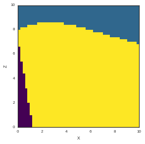

Example 3: Simple model PyMC
============================

This notebook is a series of independent cells showing how to create a
simple model from the beginning to the end using GeMpy

Importing dependencies
~~~~~~~~~~~~~~~~~~~~~~

.. code:: python

    # Importing
    import theano.tensor as T
    import sys, os
    sys.path.append("../GeMpy")
    
    # Importing GeMpy modules
    import GeMpy
    
    # Reloading (only for development purposes)
    import importlib
    importlib.reload(GeMpy)
    
    # Usuful packages
    import numpy as np
    import pandas as pn
    
    import matplotlib.pyplot as plt
    
    # This was to choose the gpu
    os.environ['CUDA_LAUNCH_BLOCKING'] = '1'
    
    # Default options of printin
    np.set_printoptions(precision = 6, linewidth= 130, suppress =  True)
    
    %matplotlib inline
    #%matplotlib notebook

Visualize data
--------------

.. code:: python

    # Setting the extent
    geo_data = GeMpy.import_data([0,10,0,10,0,10])
    
    
    # =========================
    # DATA GENERATION IN PYTHON
    # =========================
    # Layers coordinates
    layer_1 = np.array([[0.5,4,7], [2,4,6.5], [4,4,7], [5,4,6]])#-np.array([5,5,4]))/8+0.5
    layer_2 = np.array([[3,4,5], [6,4,4],[8,4,4], [7,4,3], [1,4,6]])
    layers = np.asarray([layer_1,layer_2])
    
    # Foliations coordinates
    dip_pos_1 = np.array([7,4,7])#- np.array([5,5,4]))/8+0.5
    dip_pos_2 = np.array([2.,4,4])
    
    # Dips
    dip_angle_1 = float(15)
    dip_angle_2 = float(340)
    dips_angles = np.asarray([dip_angle_1, dip_angle_2], dtype="float64")
    
    # Azimuths
    azimuths = np.asarray([90,90], dtype="float64")
    
    # Polarity
    polarity = np.asarray([1,1], dtype="float64")
    
    # Setting foliations and interfaces values
    GeMpy.set_interfaces(geo_data, pn.DataFrame(
        data = {"X" :np.append(layer_1[:, 0],layer_2[:,0]),
                "Y" :np.append(layer_1[:, 1],layer_2[:,1]),
                "Z" :np.append(layer_1[:, 2],layer_2[:,2]),
                "formation" : np.append(
                   np.tile("Layer 1", len(layer_1)), 
                   np.tile("Layer 2", len(layer_2))),
                "labels" : [r'${\bf{x}}_{\alpha \, 0}^1$',
                   r'${\bf{x}}_{\alpha \, 1}^1$',
                   r'${\bf{x}}_{\alpha \, 2}^1$',
                   r'${\bf{x}}_{\alpha \, 3}^1$',
                   r'${\bf{x}}_{\alpha \, 0}^2$',
                   r'${\bf{x}}_{\alpha \, 1}^2$',
                   r'${\bf{x}}_{\alpha \, 2}^2$',
                   r'${\bf{x}}_{\alpha \, 3}^2$',
                   r'${\bf{x}}_{\alpha \, 4}^2$'] }))
    
    GeMpy.set_foliations(geo_data,  pn.DataFrame(
        data = {"X" :np.append(dip_pos_1[0],dip_pos_2[0]),
                "Y" :np.append(dip_pos_1[ 1],dip_pos_2[1]),
                "Z" :np.append(dip_pos_1[ 2],dip_pos_2[2]),
                "azimuth" : azimuths,
                "dip" : dips_angles,
                "polarity" : polarity,
                "formation" : ["Layer 1", "Layer 2"],
                "labels" : [r'${\bf{x}}_{\beta \,{0}}$',
                  r'${\bf{x}}_{\beta \,{1}}$'] })) 
    
    
    
    layer_3 = np.array([[2,4,3], [8,4,2], [9,4,3]])
    dip_pos_3 = np.array([1,4,1])
    dip_angle_3 = float(80)
    azimuth_3 = 90
    polarity_3 = 1
    
    
    
    GeMpy.set_interfaces(geo_data, pn.DataFrame(
        data = {"X" :layer_3[:, 0],
                "Y" :layer_3[:, 1],
                "Z" :layer_3[:, 2],
                "formation" : np.tile("Layer 3", len(layer_3)), 
                "labels" : [  r'${\bf{x}}_{\alpha \, 0}^3$',
                               r'${\bf{x}}_{\alpha \, 1}^3$',
                               r'${\bf{x}}_{\alpha \, 2}^3$'] }), append = True)
    GeMpy.get_raw_data(geo_data,"interfaces")
    
     
    GeMpy.set_foliations(geo_data, pn.DataFrame(data = {
                         "X" : dip_pos_3[0],
                         "Y" : dip_pos_3[1],
                         "Z" : dip_pos_3[2],
                         "azimuth" : azimuth_3,
                         "dip" : dip_angle_3,
                         "polarity" : polarity_3,
                         "formation" : [ 'Layer 3'],
                         "labels" : r'${\bf{x}}_{\beta \,{2}}$'}), append = True)
    
    
    GeMpy.set_data_series(geo_data, {'younger': ('Layer 1', 'Layer 2'),
                          'older': 'Layer 3'}, order_series = ['younger', 'older'])
    
    GeMpy.plot_data(geo_data)

.. parsed-literal::

    <Visualization.PlotData at 0x7f96ab10cba8>

.. image:: Example_3_Simple_PyMC_files/Example_3_Simple_PyMC_5_1.png

.. code:: python

    GeMpy.set_interpolator(geo_data, u_grade = 0)
    GeMpy.compute_block_model(geo_data, series_number= 'all', verbose = 0)
    GeMpy.plot_section(geo_data, 13)

.. parsed-literal::

    <Visualization.PlotData at 0x7f96c6152a58>

.. image:: Example_3_Simple_PyMC_files/Example_3_Simple_PyMC_6_1.png

.. code:: python

    import pymc as pm
    
    inter = geo_data.interpolator._data.interfaces
    
    Z_unc = pm.Normal('Z_unc', inter['Z'], 1./np.square(10))
    @pm.deterministic
    def model(value=0, Z_unc = Z_unc):
        geo_data.interpolator._data.interfaces['Z'] = pn.DataFrame(Z_unc)
        GeMpy.compute_block_model(geo_data, u_grade = 0)
       # print(geo_data.interpolator._data.interfaces)
        return geo_data.interpolator.block.get_value()
    
    pymc_model = pm.Model([Z_unc, model])

.. code:: python

    M = pm.MCMC(pymc_model)

.. code:: python

    M.sample(4)

.. parsed-literal::

     [---------------------125%----------------------] 5 of 4 complete in 5.5 sec

.. code:: python

    GeMpy.plot_section(geo_data, 13, block = M.trace('model')()[2])

.. parsed-literal::

    <Visualization.PlotData at 0x7f96aa275a58>

